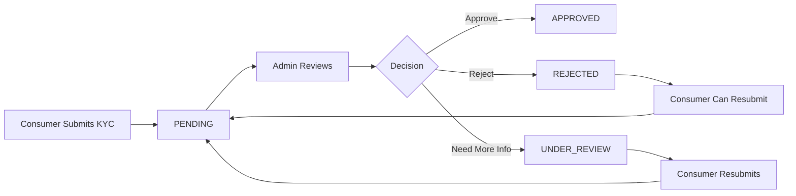

# Consumer KYC Verification Guide - Admin Panel

## Overview
The Admin Panel provides comprehensive KYC (Know Your Customer) verification functionality for both **Consumers** (from the TCC User Mobile App) and **Agents** (from the TCC Agent App). This guide explains how to access and use the KYC verification interface for consumers.

## Accessing Consumer KYC Verification

### Method 1: Through the Consumers Screen

1. **Navigate to Consumers Management**
   - Click on "Consumers" in the admin panel sidebar
   - This shows all registered consumers from the TCC User Mobile App

2. **Quick Access via Pending KYC Card**
   - Look for the **"Pending KYC (Click to Review)"** statistics card
   - This card shows the count of consumers with pending KYC verification
   - **Click on this card** to directly navigate to the KYC Submissions screen

3. **Individual Consumer Actions**
   - In the consumers table/list, each consumer with pending or under-review KYC status has a **"Review KYC"** button (verified user icon)
   - Click this button to access the KYC submissions screen
   - The button only appears for consumers with:
     - `pending` KYC status
     - `underReview` KYC status

### Method 2: Through the KYC Submissions Screen

1. **Navigate to KYC Submissions**
   - Access via sidebar: Admin Panel > KYC > Submissions
   - Or use the direct route: `/kyc-submissions`

2. **Filter by User Type**
   - The KYC Submissions screen now includes **User Type filters**:
     - **ALL** - Shows both consumer and agent submissions
     - **CONSUMER** - Shows only consumer KYC submissions
     - **AGENT** - Shows only agent KYC submissions
   - Click on the **"CONSUMER"** filter chip to view only consumer submissions

3. **Filter by Status**
   - Additional status filters are available:
     - ALL
     - PENDING
     - SUBMITTED
     - APPROVED
     - REJECTED
   - Combine user type and status filters for precise results

## KYC Verification Interface Features

### 1. Search and Filter Capabilities
```
- Search by name, email, or phone number
- Filter by user type (Consumer/Agent)
- Filter by KYC status
- Pagination for large datasets
```

### 2. KYC Submission List View
Each submission displays:
- Consumer ID and name
- Email and phone number
- Submission date
- Current KYC status with color coding:
  - 🟡 Yellow: Pending/Under Review
  - 🟢 Green: Approved
  - 🔴 Red: Rejected
  - 🔵 Blue: Submitted

### 3. Detailed KYC Review Screen
Clicking on a submission opens the detailed review screen with:
- **Consumer Information**
  - Full name
  - Email address
  - Phone number
  - Registration date
  - Account status

- **Submitted Documents**
  - Government-issued ID (passport, national ID, driver's license)
  - Proof of address
  - Selfie for verification
  - Additional supporting documents

- **Document Viewer**
  - View uploaded images directly
  - Zoom and pan functionality
  - Download option for detailed inspection

- **Review Actions**
  - **Approve**: Verify and approve the KYC submission
  - **Reject**: Reject with specific reason selection
  - **Request More Info**: Ask for additional documents

### 4. Rejection Reasons
When rejecting a KYC submission, admins can select from predefined reasons:
- Document unclear/blurry
- Document expired
- Name mismatch
- Invalid document type
- Missing information
- Document appears to be tampered
- Face not clearly visible in selfie
- Other (with custom reason input)

## KYC Status Workflow



## Best Practices for KYC Review

### 1. Document Verification Checklist
- [ ] Check document validity and expiration date
- [ ] Verify name matches registration details
- [ ] Confirm address is clearly visible
- [ ] Ensure selfie matches ID photo
- [ ] Check for signs of tampering or editing
- [ ] Verify document type is acceptable

### 2. Review Guidelines
- **Response Time**: Aim to review within 24-48 hours
- **Clear Communication**: Provide specific rejection reasons
- **Consistency**: Apply same standards to all submissions
- **Security**: Report suspicious documents to compliance team
- **Documentation**: Keep notes on complex cases

### 3. Common Issues and Solutions

| Issue | Solution |
|-------|----------|
| Blurry documents | Request clearer photos with better lighting |
| Expired documents | Ask for current valid documents |
| Name mismatch | Verify if legal name change, request supporting docs |
| Missing pages | Request complete document upload |
| Wrong document type | Specify accepted document types |

## Security Considerations

1. **Access Control**
   - Only authorized admin users can review KYC
   - All actions are logged with admin ID and timestamp
   - Audit trail maintained for compliance

2. **Data Protection**
   - Documents are encrypted in storage
   - Secure transmission using HTTPS
   - Automatic purging of rejected documents after retention period

3. **Compliance**
   - Follow local KYC/AML regulations
   - Maintain records as per regulatory requirements
   - Regular compliance audits

## Bulk Operations

For efficiency, the KYC Submissions screen supports:
- **Bulk Approval**: Select multiple submissions for approval
- **Bulk Export**: Export KYC data for reporting
- **Bulk Assignment**: Assign submissions to specific reviewers (future feature)

## API Integration

The KYC verification system uses the following API endpoints:

```javascript
// Get KYC submissions with filters
GET /v1/kyc/admin/submissions
Query params:
  - user_type: 'user' | 'agent'
  - status: 'PENDING' | 'APPROVED' | 'REJECTED'
  - page: number
  - per_page: number

// Get specific submission details
GET /v1/kyc/admin/submissions/:id

// Review submission
POST /v1/kyc/admin/review/:id
Body: {
  action: 'approve' | 'reject',
  remarks: string
}
```

## Monitoring and Reporting

### KYC Metrics Dashboard
- Total submissions by type (Consumer/Agent)
- Approval rate
- Average review time
- Pending submissions count
- Rejection reasons breakdown

### Reports Available
1. **Daily KYC Report**: New submissions and reviews
2. **Weekly Summary**: Trends and patterns
3. **Monthly Compliance Report**: For regulatory filing
4. **Exception Report**: Flagged or suspicious submissions

## Troubleshooting

### Common Issues

1. **Documents not loading**
   - Check internet connection
   - Verify file storage service is running
   - Clear browser cache

2. **Cannot approve/reject**
   - Ensure you have proper admin permissions
   - Check if submission is already processed
   - Verify backend service is running

3. **Filters not working**
   - Refresh the page
   - Clear browser local storage
   - Check console for JavaScript errors

## Support and Escalation

For issues or questions:
1. **Technical Support**: Contact IT team
2. **Compliance Questions**: Reach compliance department
3. **Urgent Issues**: Use escalation hotline

## Version History

| Version | Date | Changes |
|---------|------|---------|
| 1.0.0 | Dec 2024 | Initial KYC system implementation |
| 1.1.0 | Dec 2024 | Added user type filters for Consumer/Agent separation |
| 1.2.0 | Dec 2024 | Added quick access from Consumers screen |

---

*Last Updated: December 2024*
*Document Version: 1.2.0*