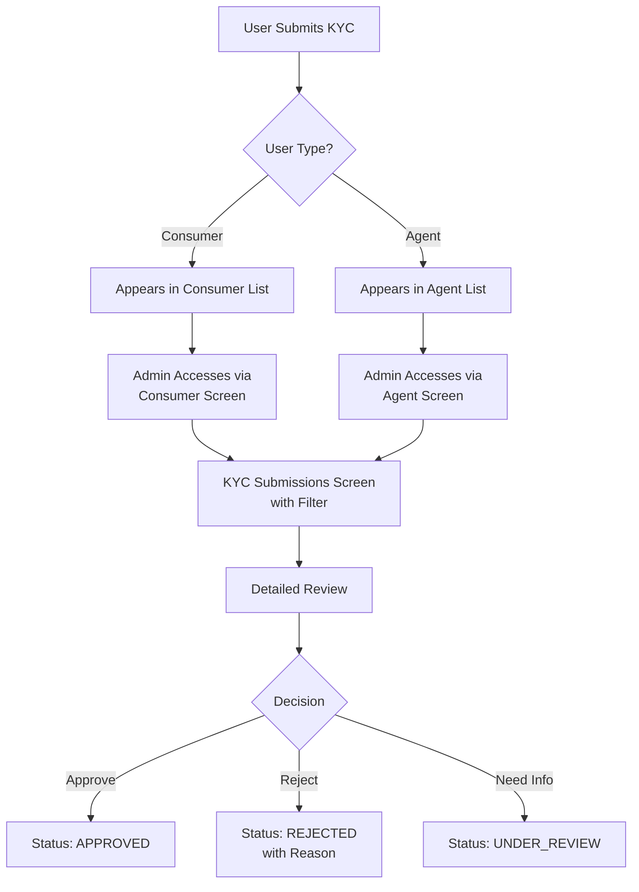

# Unified KYC Verification Guide - TCC Admin Panel

## Overview
The TCC Admin Panel provides a comprehensive and unified KYC (Know Your Customer) verification system for both **Consumers** (users from TCC User Mobile App) and **Agents** (partners from TCC Agent App). This guide explains the consistent flow and multiple access points for KYC verification.

## Key Features
✅ **Unified KYC Submissions Screen** - Central hub for all KYC reviews
✅ **User Type Filtering** - Easily separate Consumer and Agent submissions
✅ **Multiple Access Points** - Quick access from respective management screens
✅ **Consistent UI/UX** - Same review workflow for both user types
✅ **Status Tracking** - Real-time status updates and filtering

## Access Points for KYC Verification

### 🎯 Central KYC Hub
**Location**: Admin Panel > KYC > Submissions (or `/kyc-submissions`)

This is the main KYC review center where you can:
- View all KYC submissions (both Consumers and Agents)
- Filter by user type using the **User Type** filter chips
- Filter by status (Pending, Submitted, Approved, Rejected)
- Search by name, email, or phone number
- Access detailed review screens for each submission

### 👥 For Consumer KYC Verification

#### Quick Access Points:
1. **From Consumers Screen** (`Admin Panel > Consumers`)
   - Click the **"Pending KYC (Click to Review)"** statistics card
   - Use the **"Review KYC"** button (🛡️ icon) next to consumers with pending/under-review status
   - Both options navigate to the KYC Submissions screen

2. **Direct Navigation**
   - Go to KYC Submissions screen
   - Select **"CONSUMER"** from the User Type filter
   - Review consumer submissions

#### Visual Indicators:
- Yellow warning icon for pending KYC
- Statistics card shows count of pending consumer KYC
- Individual action buttons appear only for consumers needing review

### 🏪 For Agent KYC Verification

#### Quick Access Points:
1. **From Agents Screen** (`Admin Panel > Agents`)
   - Click the **"Pending KYC (Click to Review)"** statistics card
   - Use the **"Review All KYC"** button in the header
   - Use the **"Review KYC"** button (🛡️ icon) next to agents with pending/submitted status
   - For mobile view: **"Review KYC"** button appears for pending agents

2. **Direct Dialog Access**
   - Click on any agent with pending verification
   - Opens KYC Review Dialog directly for that specific agent
   - Immediate approve/reject actions available

3. **Centralized Review**
   - Go to KYC Submissions screen
   - Select **"AGENT"** from the User Type filter
   - Review agent submissions

#### Visual Indicators:
- Orange/warning color theme for agent-related actions
- Verification status badge on each agent card
- Review KYC button prominently displayed for pending agents

## Unified KYC Review Workflow



## Filter System

### User Type Filters (Purple Chips)
- **ALL** - Shows both consumer and agent submissions
- **CONSUMER** - Shows only consumer KYC submissions
- **AGENT** - Shows only agent KYC submissions

### Status Filters (Blue Chips)
- **ALL** - Shows all statuses
- **PENDING** - New submissions awaiting review
- **SUBMITTED** - Documents uploaded, ready for review
- **APPROVED** - KYC verified and approved
- **REJECTED** - KYC rejected with reasons

## Consistent Features Across Both User Types

### 1. Review Interface
Both consumer and agent KYC reviews include:
- Full user information display
- Document viewer with zoom capabilities
- Standardized rejection reasons
- Custom rejection reason input
- Approval/rejection actions
- Audit trail tracking

### 2. Document Requirements
**Consumers:**
- Government-issued ID
- Proof of address
- Selfie for verification

**Agents:**
- Business registration documents
- Personal identification
- Business location proof
- Bank account details for commission

### 3. Status Indicators
Consistent color coding across the platform:
- 🟡 **Yellow/Warning**: Pending review
- 🟢 **Green**: Approved
- 🔴 **Red**: Rejected
- 🔵 **Blue**: Submitted/Processing

### 4. Action Buttons
Standardized icons and labels:
- 🛡️ **Verified User Icon**: Review KYC action
- 👁️ **Eye Icon**: View details
- ✏️ **Edit Icon**: Modify information
- 🚫 **Block Icon**: Suspend/deactivate

## Quick Reference Table

| User Type | Management Screen | Quick Access Card | Individual Action | Central Hub Filter |
|-----------|------------------|-------------------|-------------------|-------------------|
| **Consumer** | Admin > Consumers | "Pending KYC (Click to Review)" | Review KYC button on pending users | Select "CONSUMER" |
| **Agent** | Admin > Agents | "Pending KYC (Click to Review)" | Review KYC button/dialog | Select "AGENT" |

## Best Practices

### 1. Efficient Review Process
- Use the statistics cards for quick overview of pending KYCs
- Click directly on cards to access filtered submissions
- Use individual review buttons for specific user reviews
- Leverage the central hub for bulk operations

### 2. Consistency in Decision Making
- Apply same verification standards for both user types
- Use predefined rejection reasons for consistency
- Document custom rejection reasons clearly
- Maintain audit trail for compliance

### 3. Navigation Tips
- **Quick Review**: Click pending KYC cards for immediate access
- **Bulk Review**: Use central KYC Submissions screen
- **Individual Review**: Use action buttons on user rows
- **Filter Combination**: Combine user type and status filters for precise results

## Implementation Details

### Color Themes
- **Consumer Actions**: Blue accent color (`AppColors.accentBlue`)
- **Agent Actions**: Orange/Warning color (`AppColors.warning`)
- **Status Colors**: Consistent across both types

### Navigation Routes
```dart
// Navigate to KYC Submissions
Navigator.pushNamed(context, '/kyc-submissions');

// For Agents - Direct dialog
_showKYCReviewDialog(agent);

// For Consumers - Via details dialog
_viewConsumerDetails(consumer);
```

### API Endpoints
Both user types use the same backend structure:
```
GET /v1/kyc/admin/submissions?user_type=consumer
GET /v1/kyc/admin/submissions?user_type=agent
POST /v1/kyc/admin/review/:id
```

## Security and Compliance

### Access Control
- Role-based access for KYC review
- Audit logging for all review actions
- Time-stamped decision tracking

### Data Protection
- Encrypted document storage
- Secure transmission protocols
- Automatic data retention policies

### Compliance Features
- Rejection reason tracking
- Review timeline monitoring
- Exportable audit reports

## Troubleshooting

### Common Issues

1. **Filter not working**
   - Ensure both user type and status filters are properly set
   - Refresh the page if filters don't update

2. **Review button missing**
   - Check if user has pending/submitted KYC status
   - Verify admin permissions for KYC review

3. **Cannot access KYC submissions**
   - Check route configuration in app router
   - Verify API endpoints are accessible

## Version History

| Version | Date | Changes |
|---------|------|---------|
| 1.0.0 | Dec 2024 | Initial unified KYC system |
| 1.1.0 | Dec 2024 | Added user type filtering |
| 1.2.0 | Dec 2024 | Enhanced quick access points |
| 1.3.0 | Dec 2024 | Unified agent and consumer flows |

## Summary

The unified KYC verification system provides:
- ✅ **Multiple convenient access points** for both user types
- ✅ **Consistent review workflow** across the platform
- ✅ **Clear visual indicators** for pending reviews
- ✅ **Efficient filtering** to separate user types
- ✅ **Standardized actions** and decision tracking

Admins can now easily review KYC submissions for both consumers and agents through their preferred entry point while maintaining consistency and compliance standards.

---

*Last Updated: December 2024*
*Document Version: 1.3.0*